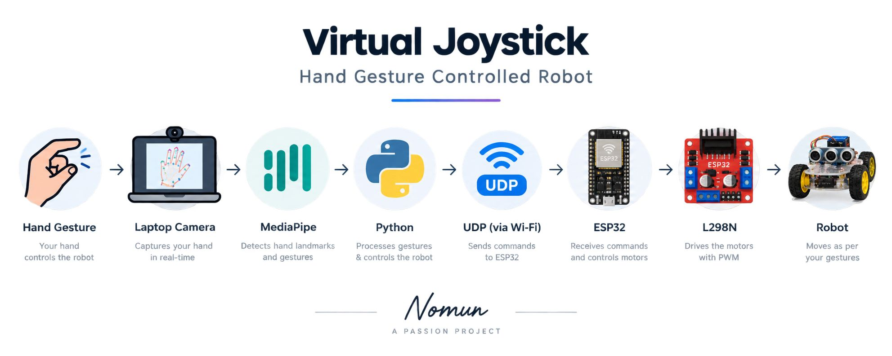
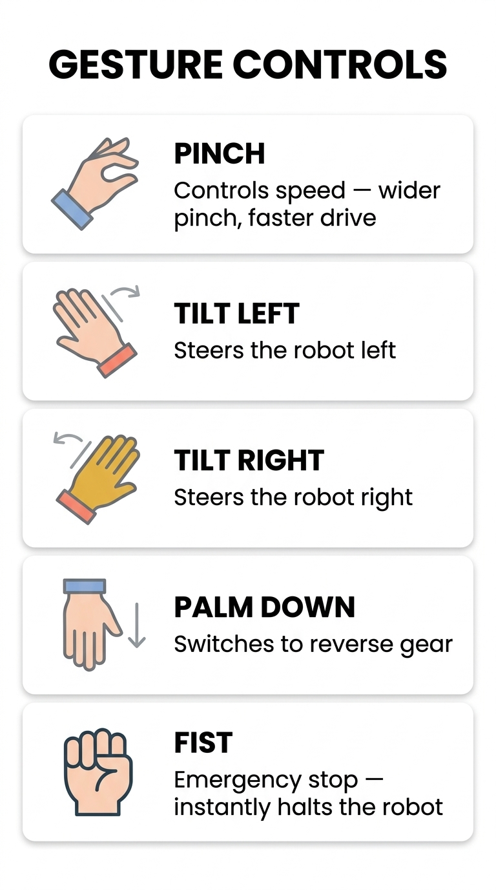
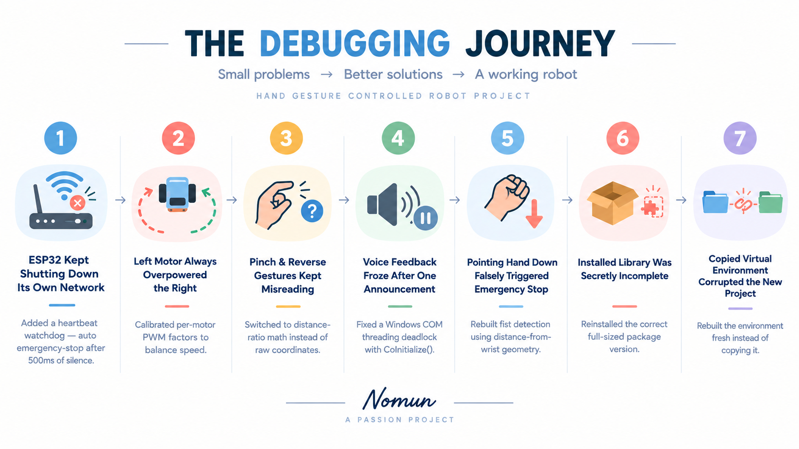

<div align="center">



# Virtual Joystick — Hand Gesture Controlled Robot

**Control a differential-drive robot car in real time using nothing but your bare hand and a laptop webcam.**

[](https://www.python.org/)
[](https://opencv.org/)
[](https://developers.google.com/mediapipe)
[](https://www.espressif.com/)
[](https://platformio.org/)
[](LICENSE)

[](https://youtube.com/shorts/cJ4aoS0Kbfs)

*Click above to watch the demo on YouTube Shorts*

</div>

---

## Abstract

Virtual Joystick replaces a physical RC controller with a single webcam and a bare hand. A laptop-side Python pipeline (OpenCV + MediaPipe Hands) extracts 21 hand landmarks per frame, converts pinch aperture and wrist tilt into proportional speed/steering values, and streams them over UDP at 20 Hz to an ESP32 running custom firmware that drives an L298N-based differential-steering chassis. The project is an end-to-end real-time computer-vision-to-embedded-control pipeline — from gesture recognition and signal smoothing on the host, to a watchdog-protected motor-control loop on the microcontroller — built and iteratively debugged from scratch as a personal robotics/CV learning project.

## Key Features & Methodology

- **Proportional gesture control** — pinch aperture (Thumb↔Index distance, normalized by Wrist↔MiddleBase distance for hand-size/camera-distance invariance) maps to 0–100% speed; wrist tilt angle maps to steering.
- **Orientation-independent fist detection** — emergency stop uses a distance-from-wrist geometric test instead of raw Y-coordinate comparison, so it works correctly at any hand orientation (including the reverse-gear "palm down" pose).
- **Reverse gear** — a distinct palm-down gesture triggers a fixed-magnitude reverse command, with its own reticle color, audio cue, and HUD state.
- **3-thread real-time architecture** — camera/CV thread (hard-capped 30 FPS), a queue-based TTS audio thread (Windows COM-safe), and a 20 Hz UDP heartbeat thread — so voice/network I/O never blocks the video loop.
- **EMA-smoothed control signal** — an exponential moving average filter removes landmark jitter before it reaches the speed/tilt dead-zone logic.
- **Differential steering firmware** — the ESP32 converts signed `(speed, tilt)` commands into independently calibrated left/right PWM duty cycles, with a proportional inside-wheel reduction for turning.
- **Heartbeat failsafe** — the ESP32 auto-executes an emergency stop if it goes >500 ms without a valid packet, protecting against Wi-Fi drop or a crashed controller script.
- **"Iron Man" HUD** — a custom OpenCV-drawn dashboard with a gradient speed bar, an aviation-style attitude/tilt dial, a state-reactive neon reticle, and a toggleable cinematic recording mode.

## Gesture Controls



| Gesture | Robot Action | Mechanism |
|---|---|---|
| **Pinch** (Thumb↔Index) | Forward speed 0–100% | `dist(4,8) / dist(0,9)` ratio mapped to speed |
| **Hand Tilt Left/Right** | Steering | `atan2` of Wrist→MiddleBase vector vs. vertical |
| **Palm Down** | Reverse gear | `MiddleBase[9].y > Wrist[0].y + 0.15` |
| **Closed Fist** | Emergency Stop | All 4 fingertips closer to wrist than their PIP joints |

<br clear="right">

## System Architecture

```
┌───────────────────────────────┐    Wi-Fi (ESP32 AP)     ┌────────────────────────────┐
│           LAPTOP               │ UDP "S85T-12" @ 20 Hz ─►│           ESP32              │
│  Webcam → MediaPipe → Gesture  │                          │  Parse → PWM → L298N         │
│  Math → EMA → HUD → UDP Tx     │                          │  Differential Steering        │
└─────────────────────────────────┘                          └──────────────┬───────────────┘
                                                                             │
                                                                   ┌─────────┴─────────┐
                                                                   │    L298N Driver    │
                                                                   │ Left Motor│Right   │
                                                                   └────────────────────┘
```

**Laptop-side threading model**

```
MAIN THREAD  → cap.read() → MediaPipe → Gesture Math → HUD      (30 FPS cap)
AUDIO THREAD → pyttsx3 queue consumer, never blocks video
UDP THREAD   → sock.sendto() @ 20 Hz, formats "S{speed}T{tilt}"
```

**UDP payload:** `S[Speed]T[Tilt]` — e.g. `S85T-12` (85% fwd, 12° left), `S-90T0` (reverse), `S0T0` (stop).

## The Debugging Journey



Real problems hit — and fixed — while building this:

- ESP32 kept dropping its own AP under load → added a 500 ms heartbeat watchdog with auto emergency-stop
- Left motor consistently overpowered the right → introduced per-motor PWM calibration factors
- Pinch/reverse gestures misread each other → switched from raw coordinates to distance-ratio geometry
- Voice feedback froze after the first announcement → fixed a Windows SAPI5 COM threading deadlock with `CoInitialize()`
- Pointing the hand down falsely triggered emergency stop → rebuilt fist detection using distance-from-wrist geometry (orientation-independent)
- A partially-installed MediaPipe wheel silently broke imports → reinstalled the correct full package version
- Copying a Python venv between project folders corrupted the new one → rebuilt virtual environments fresh instead of copying them

## Version History

The controller script went through three iterations — each one fixing real bugs hit during development (see [Debugging Journey](#the-debugging-journey) above). `software/laptop-controller/` holds the final, working **v3**; the earlier iterations are kept in `archive/` for anyone who wants to see the progression.

| Version | What changed |
|---|---|
| **v1** | Initial multithreaded script: camera/MediaPipe, queue-based TTS, 20 Hz UDP, proportional speed/tilt, professional HUD |
| **v2** | Cinematic "Iron Man" neon visuals, HUD contrast/legibility fixes, EMA smoothing, smart audio-trend debouncing, cinematic recording toggle |
| **v3** *(current)* | Windows SAPI5 COM deadlock fix, orientation-independent fist detection, reverse gear (palm-down gesture), reverse-aware command classification & TTS |

## Folder Structure

```
cv-gesture-rover-esp32/
├── README.md
├── LICENSE
├── media/
│   ├── pipeline-overview-banner.jpg
│   ├── gesture-controls-chart.jpg
│   └── debugging-journey.png
├── hardware/
│   └── esp32-firmware/
│       ├── platformio.ini
│       └── src/
│           └── main.cpp
├── software/
│   └── laptop-controller/
│       ├── virtual_joystick.py      # v3 — current
│       └── requirements.txt
└── archive/
    ├── python-v1/
    │   └── virtual_joystick.py
    └── python-v2/
        └── virtual_joystick.py
```

## Getting Started

### Prerequisites

**Laptop (software side)**
- Python 3.11+
- A webcam
- `opencv-python`, `mediapipe==0.10.9`, `protobuf==3.20.3`, `pyttsx3` (Windows also needs `pywin32`)

**Robot (hardware side) — Bill of Materials**

| Component | Notes |
|---|---|
| ESP-WROOM-32 Dev Board | Any 38-pin variant |
| L298N Dual H-Bridge | 5–35V motor supply |
| 2× Brushed DC motors | TT / N20 gear motors |
| 7.4V 2S LiPo (or 6×AA) | Powers L298N + ESP32 |
| 2WD chassis | Any |
| [PlatformIO](https://platformio.org/) (VS Code extension) | Firmware build tool — `main.cpp` uses PlatformIO's `src/` layout; rename to `.ino` and open in Arduino IDE if you prefer that workflow instead |

### Installation

**1. Laptop controller**

```bash
git clone https://github.com/rootmesh3/cv-gesture-rover-esp32.git
cd cv-gesture-rover-esp32/software/laptop-controller
python -m venv venv
venv\Scripts\activate          # Windows
pip install -r requirements.txt
```

Edit the two config lines at the top of `virtual_joystick.py`:
```python
ESP_IP   = "192.168.4.1"
ESP_PORT = 4210
```

**2. ESP32 firmware**

- Open `hardware/esp32-firmware/` as a PlatformIO project in VS Code.
- Wire the L298N per the pin map in `main.cpp` (ENA=32, IN1=25, IN2=26, IN3=27, IN4=14, ENB=33).
- Flash: `pio run --target upload`
- Connect your laptop's Wi-Fi to the `VirtualJoystick_AP` network the ESP32 creates.

### Usage

```bash
python virtual_joystick.py
```

| Key | Action |
|---|---|
| `Q` | Quit |
| `M` | Mute/unmute voice feedback |
| `R` | Toggle cinematic recording mode |

## Future Scope

- Speed ramping (acceleration/deceleration curves) for smoother starts/stops
- Wheel encoders for closed-loop speed control
- ESP-NOW radio link to remove the Wi-Fi/webcam-laptop dependency
- OTA firmware updates
- Two-hand gesture vocabulary (e.g. arm gestures for camera pan/tilt)

## License

Distributed under the MIT License. See [`LICENSE`](LICENSE) for details.

## Contact

**Author:** Nomun ([@rootmesh3](https://github.com/rootmesh3)) — repo: [cv-gesture-rover-esp32](https://github.com/rootmesh3/cv-gesture-rover-esp32)
LinkedIn: *add your link here*
Email: *add your email here*

---

<div align="center"><i>A passion project — built to learn real-time computer vision and embedded control, end to end.</i></div>
